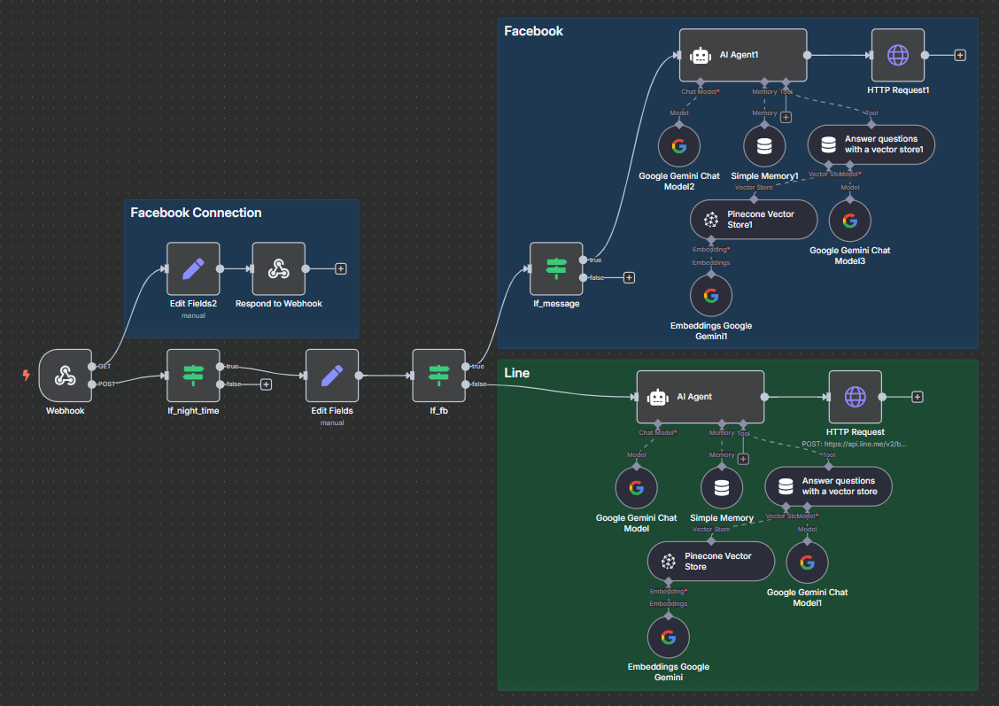
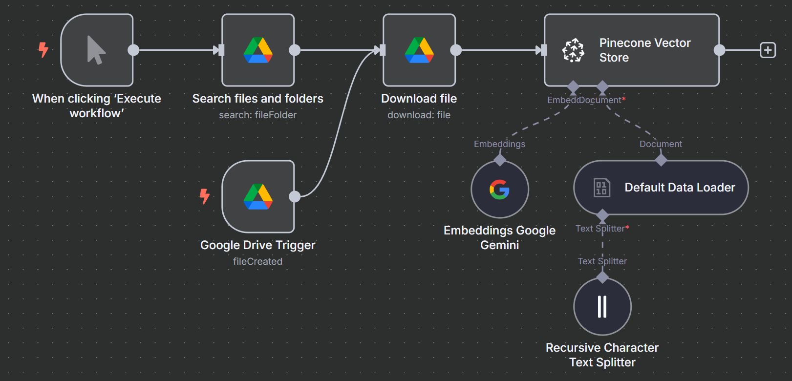

# Hotel Service Line & Facebook Chatbot

This project sets up an AI chatbot for hotel service on **LINE** and **Facebook Messenger**, powered by **n8n** workflows, **RAG (Retrieval-Augmented Generation)**, and **Pinecone** vector database. It uses **ngrok** to expose the local server for webhook communication.

---

## 🛠 Tools & Resources

### Required Tools

- [LINE Official Account Manager](https://manager.line.biz/account/)
- [Meta Developer Platform](https://developers.facebook.com/?locale=th_TH)
- [Node.js](https://nodejs.org/)
- [n8n](https://n8n.io/) – Workflow automation tool
- [ngrok](https://ngrok.com/) – Tunnels local server to public URL
- Pinecone – Vector Database for RAG
- Gemini AI (or other LLMs)

---

## 🚀 Getting Started

### Running n8n

Start `n8n` using:

```bash
n8n
```

### Running ngrok

1. Open `ngrok.exe`
2. Run the following command:

```bash
ngrok http http://localhost:5678
```

3. Copy the `Forwarding URL` and update webhooks in:
   - **LINE** → `Settings → Messaging API → Webhook URL`
   - **Facebook** → `Messenger API Settings → Webhook URL`

---

## 📸 Workflow Overview

### LINE & Facebook Chatbot Workflow in n8n


### RAG + PineconeDB Integration


---

## 🧠 Learning Resources

- [Download & Install n8n – Patiphan](https://youtu.be/l4Pr8UuWkhY?si=x0ZuQ2OQ056MM3Zl)
- [LINE & Facebook Chatbot Setup – BoomBigNose](https://youtu.be/KLZA3L3fMlI?si=0Bfkze_dQzc9lSrd)
- [Gemini AI Integration](https://youtu.be/l-HR96u2tTw?si=Dwn6mP9PvgZmS9dP)
- [Google Credentials Setup in n8n](https://www.youtube.com/watch?v=3Ai1EPznlAc&pp=0gcJCfwAo7VqN5tD)
- [AI Chatbot + RAG + Pinecone DB](https://youtu.be/ZRHH5VkUgIQ?si=Q6yUp8mq9my5HDEx)
- [Facebook Chatbot Tutorial](https://youtu.be/g12rVnBraEA?si=YwlDxulD5F7l3jLT)

---

## ⚙️ Auto-Start on Windows Boot

To run `n8n` and `ngrok` automatically at startup using **Windows Task Scheduler**:

### 1. Create Startup Batch Script

Create a file named `start-n8n-ngrok.bat`:

```bat
@echo off
REM === Set env vars for n8n ===
set N8N_HOST=localhost
set N8N_PORT=5678
set WEBHOOK_URL=http://localhost:5678/

start "" "C:\ngrok-v3-stable-windows-amd64\ngrok.exe" http http://localhost:5678

REM === Give a 3s delay before starting n8n ===
timeout /t 3

cd C:\Users\<YourUsername>\AppData\Roaming\npm
start "" n8n
```

> 🔁 Replace `<YourUsername>` with your Windows username.

---

### 2. Schedule Task on Boot

1. Open **Task Scheduler** (`Windows + R` → `taskschd.msc`)
2. Click **Create Basic Task...**
   - **Name**: `Start n8n ngrok`
   - **Trigger**: When the computer starts
   - **Action**: Start a program
     - Path: `C:\path\to\start-n8n-ngrok.bat`
   - **Finish**

---

### 3. Auto-Restart on Crash

- Go to **Task Scheduler Library**
- Right-click `Start n8n ngrok` → **Properties**
- In **Settings** tab:
  - ✅ *"If the task fails, restart every"* → `1 minute`
  - ✅ *"Attempt to restart up to"* → `3 times` (optional)
  - ✅ *"Restart task if it stops unexpectedly"*

---

## 📌 Notes

- You must re-paste the ngrok forwarding URL into both LINE and Facebook webhook settings each time ngrok restarts.
- Consider using [ngrok auth token and reserved domains](https://ngrok.com/docs) to avoid this manually.

---

## 📬 Contact

For questions, support, or contributions, feel free to open an issue or pull request.

---
